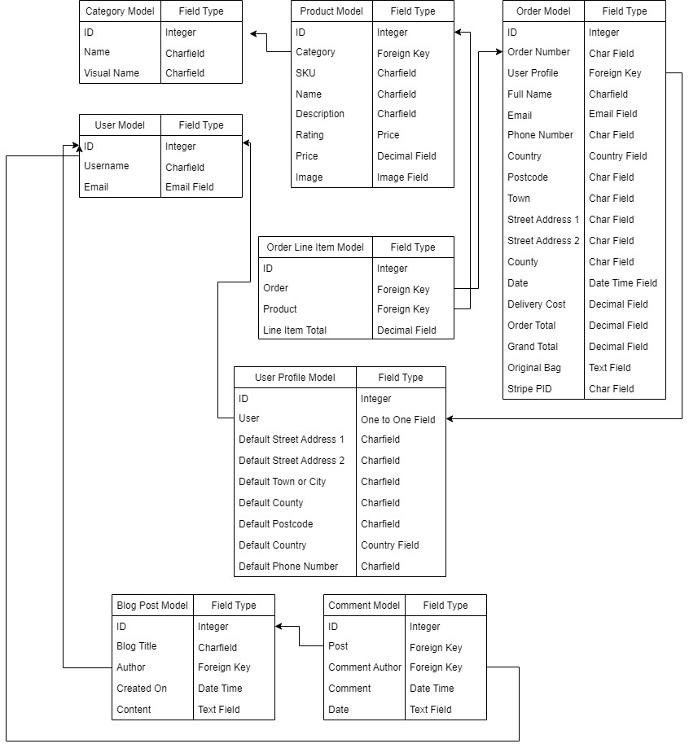

<h1 align="center">Zafiya2</h1>

[View the live project here](https://zafiya2.herokuapp.com/)

### Brief outline of websites purpose.
This is a fictational store with fully operational payment processing facilites.

## User Experience (UX)
***
- ### User stories
    - #### Unregistered User goals
        1. I want to be able to add and adjust items within my shopping bag.
        2. I want to be able to complete a purchase without having to log in.
        3. I want to be able to search products throughout the store.
    - #### Registered User goals:
        1. I want to be able to register an account that stores my details.
        2. I want to be able to see my past orders within my profile.
        3. I want to be able to add and adjust comments to the blog.
    - #### Admin Goals
        1. I want to be able to add, update and delete products within the store.
        2. I want to be able to add, update and delete blog posts.
- ### Design
    * #### Color Scheme
        -  

    * #### Imagery
        - 

- ### Wireframes
    

Main Page Wireframe:

    
    

    

Wireframe:

    
    

## Features
***
* ### Current Features
    * Main Page:
        1. All users can navigate products by type.
        2. Any user can register an account or log in.
        3. Any user can access the blog page and view comments.
        4. Any user can view the basket amount.
        5. Any user can search products throughout the store - fixed to the top.

    * Products Page:
        1. Any user can add a product to their bag.
        2. Admin can edit or delete a product.
    
    * Products Details Page:
        1. Any user can view the specific details of the product on its own dedicated page.
        2. The quantity of a product can be added using the increment and decrement button before adding to the basket.

    * Blog Page:
        1. Any user can add view a blogpost and read its details.
        2. Admin can create, edit or delete a blogpost.
        3. Any logged in user can create, update and delete their own comments to a blogpost.
        4. Any user can search through the blogpost.
    
    * My Profile Page:
        1. Registered users can store their delivery details and update it too.
        2. Registered users can view their order history.

    * Admin Access Page;
        1. Admin can add products from a dedicated page which is not viewable to non superusers.

    
* ### Future Features
    * Due to time constraints, the following features could not be added but will be enabled in the future;
        1. 
        2. 
        3. 
        4. 
        5. 
        
        
## Technologies Used
***
* ### Languages Used
    * HTML5
    * CSS3
    * jQuery
    * PYTHON 3
    * 
    * 
    * 
    * 

* ### Frameworks, Libraries & Programs Used
    * Bootstrap4
    * Django
    * 
    * 
    * 
* ### Development Tools.
    * Github:
        - Used to store the projects after being pushed using Git.
    * Gitpod:
        - Hosts the coding workspace.
    * Heroku:
        - Cloud platform for deploying the app.
    * AWS:
        - Used to store media files.
    * PostgreSQL:
        - Used to store backend relational data.
    * Google Fonts:
        - Used for fonts throughout the website.
    * Font Awesome:
        - Used to create icons for enhanced asthetics.

* ### Database structure.
    * PostgreSQL.
    

PostgreSQL Model Diagram:

    
    
        

## Testing
***
* ### Testing user stories from user experience (UX).
    [View testing results here.](static/docs/manual-user-story-testing.md)    

* ### Testing Stripe Payments.
    [View testing results here.]() 
        
* ### Code validation.
    

HTML Validation Test;:

    
    

    

CSS Validation:

    
    

    

JSHint Validation:

    
    

    
    

PEP 8 Tests:

    

    

* ### Supported screens and browsers.
    * Mobiles
        - Iphone 12 Pro, Iphone X, Iphone SE, Iphone XR , Samsung Galaxy S20 Ultra, Samsung Galaxy S20 Plus, Samsung Galaxy Note 9, Samsung SA51/71, Samsung Galaxy s9.
    * Tablets
        - iPad Mini, iPad Air, iPad, iPad Pro, Samsung Tab S6
    * Laptops
        - 15" - 17" screens
    

* ### Fixed bugs.
    1. Problem.
        - Fix: 

* ### Known errors.
    1. 
    2. 
    3. 

## Deployment
***

## Credits
***
* ### Code
    - 

* ### Media
    - 

* ### Acknowledgements
    - 
