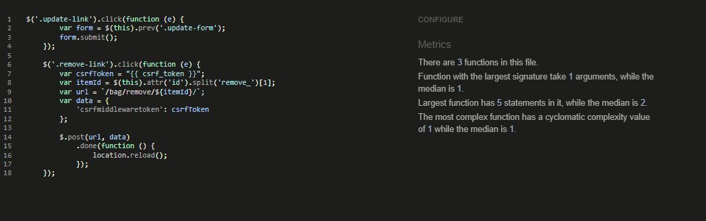

<h1 align="center">Zafiya2</h1>

[View the live project here](https://zafiya2.herokuapp.com/)

### Brief outline of websites purpose.
This is a fictational store with fully operational payment processing facilites.

## User Experience (UX)
***
- ### User stories
    - #### Unregistered User goals
        1. I want to be able to add and adjust items within my shopping bag.
        2. I want to be able to complete a purchase without having to log in.
        3. I want to be able to search products throughout the store.
    - #### Registered User goals:
        1. I want to be able to register an account that stores my details.
        2. I want to be able to see my past orders within my profile.
        3. I want to be able to add and adjust comments to the blog.
    - #### Admin Goals
        1. I want to be able to add, update and delete products within the store.
        2. I want to be able to add, update and delete blog posts.
- ### Design
    * #### Color Scheme
        -  White, Black, Dark Grey (all taken from Bootstrap)

    * #### Imagery
        - Imaages of house frgarnaces throughout are designed to remind the user of the sites purpose.

- ### Wireframes
    

Main Page Wireframe:

    
    

    

Products Wireframe:

    
    

    

Products Details Wireframe:

    
    

## Features
***
* ### Current Features
    * Main Page:
        1. All users can navigate products by type.
        2. Any user can register an account or log in.
        3. Any user can access the blog page and view comments.
        4. Any user can view the basket amount.
        5. Any user can search products throughout the store - fixed to the top.

    * Products Page:
        1. Any user can add a product to their bag.
        2. Admin can edit or delete a product.
    
    * Products Details Page:
        1. Any user can view the specific details of the product on its own dedicated page.
        2. The quantity of a product can be added using the increment and decrement button before adding to the basket.

    * Blog Page:
        1. Any user can view a blogpost and read its details.
        2. Admin can create, edit or delete a blogpost.
        3. Any logged in user can create, update and delete their own comments to a blogpost.
        4. Any user can search through the blogpost.
    
    * My Profile Page:
        1. Registered users can store their delivery details and update it too.
        2. Registered users can view their order history.

    * Admin Access Page;
        1. Admin can add products from a dedicated page which is not viewable to non superusers.

    
* ### Future Features
    * Due to time constraints, the following features could not be added but will be enabled in the future;
        1. Email facility
        2. Adding more personalisation to profiles.        
        
## Technologies Used
***
* ### Languages Used
    * HTML5
    * CSS3
    * jQuery
    * PYTHON 3

* ### Frameworks, Libraries & Programs Used
    * Bootstrap4
    * Django

* ### Development Tools.
    * Github:
        - Used to store the projects after being pushed using Git.
    * Gitpod:
        - Hosts the coding workspace.
    * Heroku:
        - Cloud platform for deploying the app.
    * AWS:
        - Used to store media files.
    * PostgreSQL:
        - Used to store backend relational data.
    * Google Fonts:
        - Used for fonts throughout the website.
    * Font Awesome:
        - Used to create icons for enhanced asthetics.

* ### Database structure.
    
    

PostgreSQL Model Diagram:

    
    
        

## Testing
***
* ### Testing user stories from user experience (UX).
    [View testing results here.](static/docs/manual-user-story-testing.md)

* ### Testing registration and accounts.
    [View testing results here.](static/docs/registration-account.md)

* ### Testing checkout.
    [View testing results here.](static/docs/checkout-testing.md)

* ### Testing blogposts and comments.
    [View testing results here.](static/docs/blog-comments.md)

* ### Testing Products and Profile.
    * These have been extensively tested however I could not document the results here due to time constraints.

        
* ### Code validation.
    

HTML Validation Test:

    
    

    

CSS Validation:

    
    

    

JSHint Validation:

    

    

    
    

    
    * PEP8 results are discussed below in known errors.

* ### Supported screens and browsers.
    * Mobiles
        - Iphone 12 Pro, Iphone X, Iphone SE, Iphone XR , Samsung Galaxy S20 Ultra, Samsung Galaxy S20 Plus, Samsung Galaxy Note 9, Samsung SA51/71, Samsung Galaxy s9.
    * Tablets
        - iPad Mini, iPad Air, iPad, iPad Pro, Samsung Tab S6
    * Laptops
        - 15" - 17" screens
    

* ### Fixed bugs.
    1. Problem - 2 payments were being created in my 1st workspace, I could not find what triggered the 2nd payment intent and in turn was creating 2 orders backend.
        - Fix: I created a new checkout app but had the same issue still. So I created a new project altogether. The link to the repo is below:

        [View the old project here](https://github.com/BegumDev/zafiya)

* ### Known errors.
    1. Example.com in emails - this was set when the Heroku was first created by following CI videos. With tutor help I could not find how to adjust it.
    2. Orders display in the profile but it runs out of space. Due to time constraints I could not apply its fix.
    3. HTML errors - The nav has 2 ids - this was taken from Bootstrap and I could not remove the ID tags into class tags. I have sought tutor support on this matter but we are both unsure how to deal with this as I had taken it from bootstrap.
    4. PEP8 errors;
        * E501 - env file error - the keys cannot be shortened nor broken down the middle.
        * VSCODE errors - these are errors pertaining to the template which is outside my knowlede base.
        * Migrations errors - these, again are created backend with tutor support and I'm advised to leave them.
        * Checkout signals error - the code base is the exact same as CI thus I couldnt change it.
        * E501 - in checkout app - again I tried numberous times to break up the lines but any configuration would break the code.
        * E501 - in settings file - again these are pre - configured.

        For the risk of creating bigger bugs and with tutor support guidance - I am advised to leave these and research these in the future. I acknowledge these are PEP8 errora however they are either outside my knowledge base or break the code.

## Deployment
***
1. Create Heroku App
    1. Connecting to Heroku:
        * Using Gitpod and having pushed to Github the project was deployed to Heroku using the following steps.
            1. Log in to Heroku, create a new app by clicking "new" and "create new app".
            2. Give it a name and set the regios closest to you.
            3. Add PostgreSQL in the resources tab.
            4. Create a requirements.txt file using command pip3 freeze > requirements.txt.
            5. Create a Procfile with the terminal command web: gunicorn knit_happens.wsgi:application.
            6. Connect to Heroku using the CLI with commmand 'Heroku login -i" and input login details.
            7. Type 'heroku:config:set DISABLE_COLLECTSTATIC=1 --app' to disable COLLECTSTATIC for now so that Heroku won't try to collect static files when we deploy. AWS will handle this
            8. Add Heroku app name to ALLOWED_HOSTS in settings.py.
            9. Push changes and deploy to heroku (connect the app to Heroku using 'connect to Github).
            10. Deploy to Heroku using git push heroku main.
            11. Type python3 manage.py loaddata categories.json and python3 manage.py loaddata products.json using the fixtures file to load data onto the database.
            12. Create a superuser using command: heroku run python3 manage.py createsuperuser so that you can log in to admin.
            12. Now prepare for AWS.

    2. Connect to AWS
        1. Create Amazon AWS account and create a new bucket in the S3 services and choose your closest region.
        2. Uncheck block all public access and create bucket.
        3. From Properties tab turn on static website hosting using default values of index.html and errors.html.
        4. On permissions tab include CORS configuration:
        
        5. Create security policy: S3 Bucket Policy, allow all principles by adding a * and Amazon S3 services and selecting Get Object action. Paste ARN from Bucket Policy, add statement, generate policy and copy and paste into Bucket Policy. Also add /* at end of resource key to allow use of all pages.
        6. Under public access select access to all List Objects.
        7. Create Group for the bucket through IAM. Create policy by importing AWS S3 Full Access policy and add ARN from bucket to the policy resources. Attach policy to group.
        8. Create user, give programmatic access and add user to the group. Download CSV file when prompted to save access key ID an secret access key to save to environment and config variables.
        9. Add AWS_STORAGE_BUCKET_NAME, AWS_S3_REGION_NAME = 'eu-west-2' to settings.py.
        10. Add, commit and push to GitHub then navigate to Heroku to confirm static files collected successfully on the Build Log. The DISABLE_COLLECTSTATIC variable can now be deleted.

    3. Connect Gmail
        1. Go to your Gmail account and navigate to the 'Settings' tab.
        2. Go to 'Accounts and Imports', 'Other Google Account Settings'.
        3. Go to the 'Security' tab, and scroll down to 'Signing in to Google'.
        4. If required, click to turn on '2-step Verification**', then 'Get Started', and enter your password.
        5. Verify using your preferred method, and turn on 2-step verification.
        6. Go back to 'Security', 'Signing in to Google', then go to 'App Passwords'.
        7. Enter your password again if prompted, then set 'App' to Mail, 'Device' to Other, and type in Django.
        8. Copy and paste the passcode that shows up, this is your 'EMAIL_HOST_PASS' variable to add to your environment/config variables. 'EMAIL_HOST_USER' is the Gmail email address.

    4. Confiv Vars
        1. SECRET_KEY: This is a random string provided when creating the Django project and can easily be changed to ensure extra security.
        2. DATABASE_URL: This is temporary.
        3. STRIPE_PUBLIC_KEY: Retrived from Stripe Dashboard in the Developer's API section (Publishable key).
        4. STRIPE_SECRET_KEY: Retrived from Stripe Dashboard in the Developer's API section (Secret key)
        5. STRIPE_WH_SECRET: Retrived from Stripe Dashboard in the Developer's after creating an endpoint for your webhook (Signing secret).
        6. EMAIL_HOST_USER: Your email address or username. See below for instructions.
        7. EMAIL_HOST_PASS: Your passcode from your email client. See below for instructions.
        8. AWS_SECRET_ACCESS_KEY: From the CSV file that you download having created a User in Amazon AWS S3. See below for instructions.
        9. AWS_ACCESS_KEY_ID: From the CSV file that you download having created a User in Amazon AWS S3. See below for instructions.

## Credits
***
* ### Code
    - The code base was heavily supported by Code Institute.

* ### Media
    - All media files are not taken from google images and in no means my own. They are only used for illustration purposes.

* ### Acknowledgements
    - My sincerest thanks to tutor support for the incredible help and all my fellow in Code Institute.
